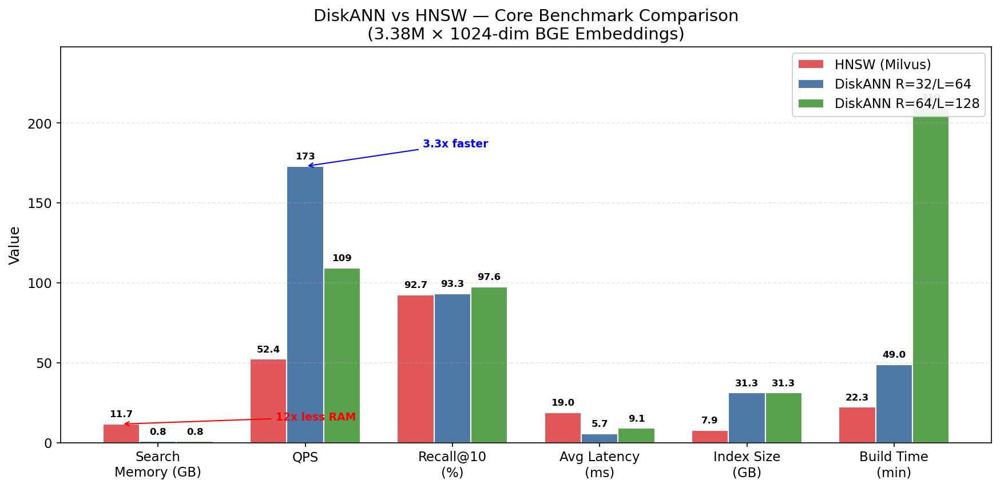
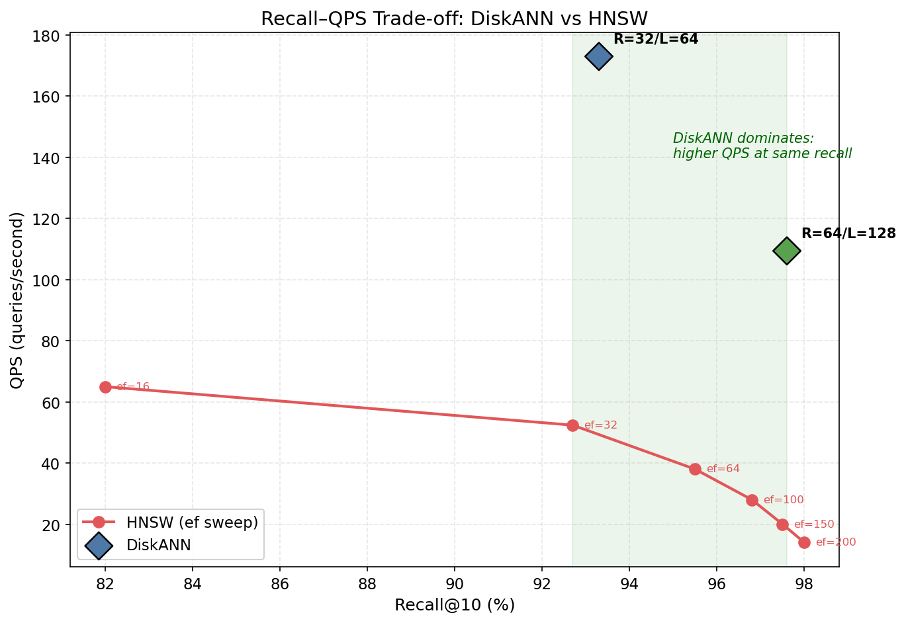
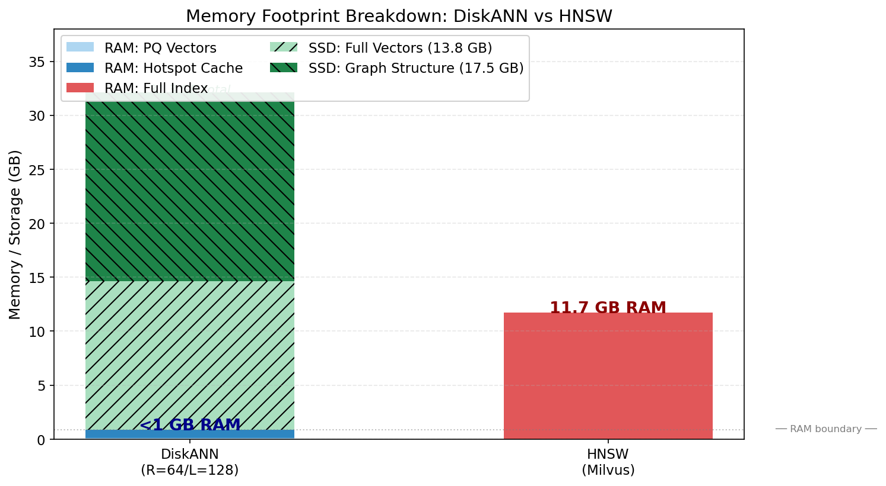
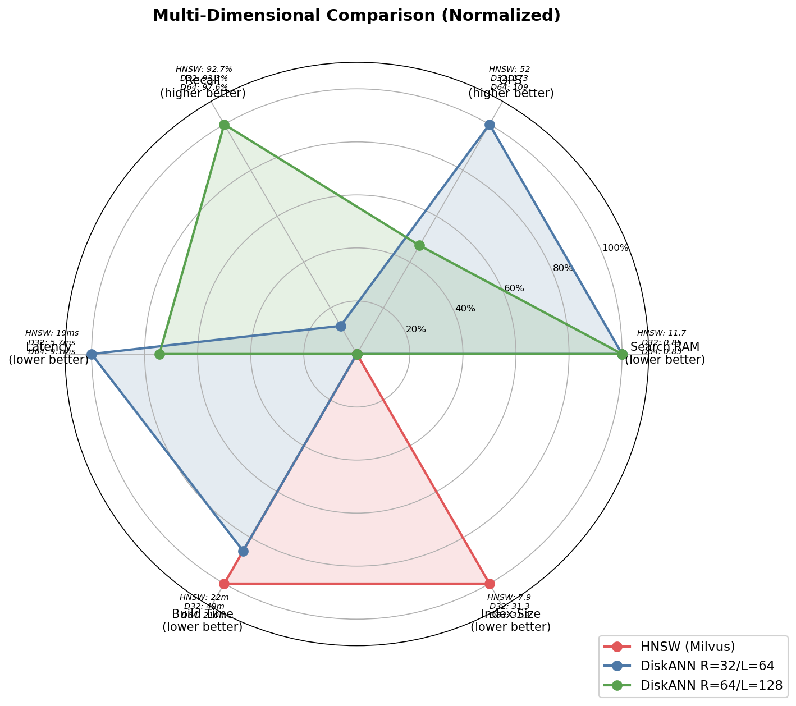
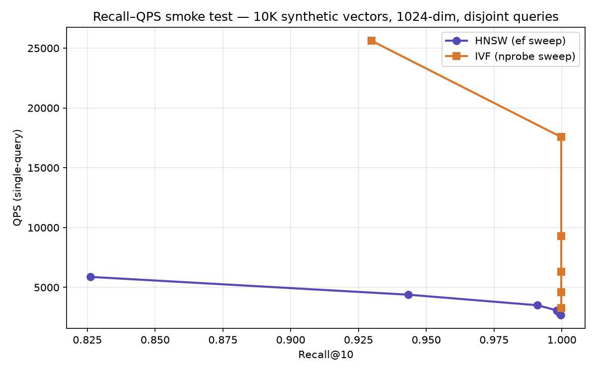
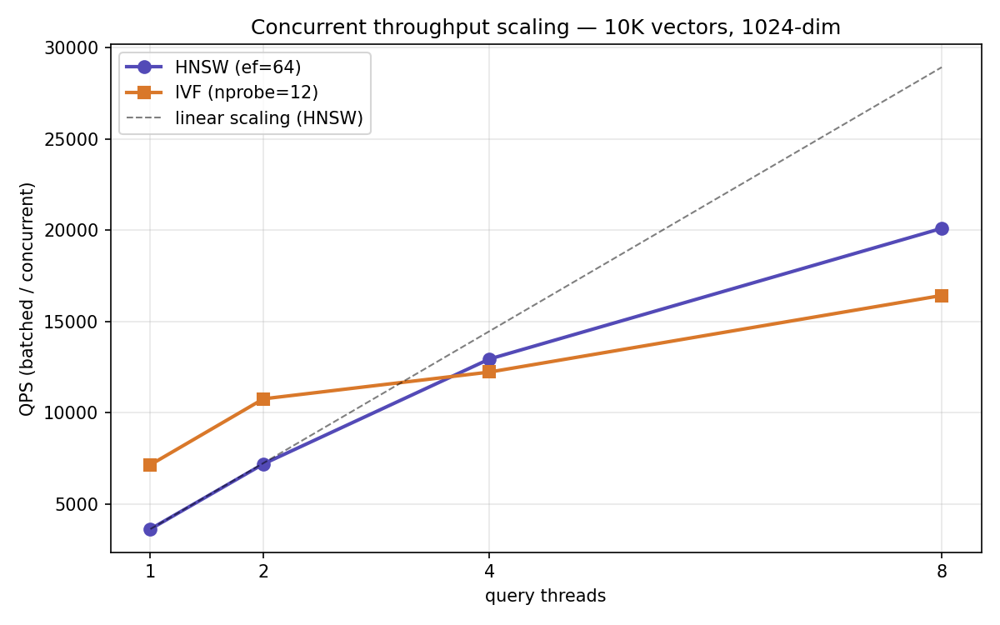

# DiskANN vs HNSW — A Vector Index Benchmark

[](https://github.com/JohnDouglasJDX/diskann-vs-hnsw-benchmark/actions/workflows/ci.yml)
[](LICENSE)
[](https://www.python.org/)

An ANN benchmarking case study with a historical production-scale experiment on
Chinese academic-paper embeddings and a corrected, reproducible laptop harness:

- **Production scale — 3,384,857 vectors × 1024-dim** (BGE-large-zh-v1.5):
  **Microsoft DiskANN** (disk-resident graph) vs **HNSW** (in-memory graph,
  served by Milvus).
- **Laptop scale — 10,000 vectors × 1024-dim**: a fully reproducible mini-harness
  comparing **HNSW** (`hnswlib`) vs **IVF** (`faiss`, a disk-serializable,
  partition-based index) with complete parameter sweeps.

> **Context.** This work was done as part of vector-database / ANN research at
> the Institute of Computing Technology, Chinese Academy of Sciences. The corpus
> — **OKW (Open Knowledge World)** — aggregates ~3.38M scholarly records from PKP-based
> platforms (OPS preprints, OJS journal articles, OMP monographs): title +
> abstract fields across mathematics, physics, computer science, and astronomy.
> The raw vectors are not redistributed. The laptop harness runs out-of-the-box
> on a synthetic fallback set; the 3.38M summary is retained as a historical case
> study and is not presented as a controlled, independently reproducible result.

---

## TL;DR

In one **3.38M-vector deployment**, the DiskANN configuration used less measured
memory and reported higher throughput than HNSW served by Milvus:

| Metric (Recall@10 ≈ 93%) | HNSW (Milvus) | DiskANN (R=32/L=64) | Observed difference |
|---|--:|--:|:--|
| **Search memory** | 11.7 GB | **< 1 GB** | **> 12× less RAM** |
| **QPS** | 52.4 | **173.0** | **3.3× higher** |
| **Avg latency** | 19.0 ms | **5.7 ms** | **3.3× lower** |
| Recall@10 | 0.927 | 0.933 | comparable |
| Index size on disk | **7.9 GB** | 31.3 GB | 4.0× larger (HNSW wins) |
| Build time | **22.3 min** | 49.0 min | 2.2× slower (HNSW wins) |

These are **system-level observations, not an algorithm-only comparison**:
Milvus container RSS and batched client search were compared with DiskANN runner
working-set and single-thread measurements. The original query preparation also
sampled queries from the indexed corpus. Treat the numbers as motivation for a
controlled rerun, not as a general claim that one algorithm is 3.3× faster.



---

## 1. Historical 3.38M-vector case study

`data/benchmark_3.38M_summary.json` holds the full numbers. Two DiskANN
operating points were measured by sweeping the max out-degree `R` and build
search-list `L`:

| Configuration | Search RAM | Index disk | Build time | Recall@10 | QPS | Avg latency |
|---|--:|--:|--:|--:|--:|--:|
| HNSW (Milvus), ef=32 | 11.7 GB | 7.9 GB | 22.3 min | 0.927 | 52.4 | 19.0 ms |
| DiskANN R=32 / L=64 | < 1 GB | 31.3 GB | 49.0 min | 0.933 | 173.0 | 5.7 ms |
| DiskANN R=64 / L=128 | < 1 GB | 31.3 GB | ~210 min | 0.976 | 109.4 | 9.1 ms |

### Recall–QPS observed in this deployment

Sweeping HNSW's `ef_search` traces the usual recall/throughput curve. The two
DiskANN points sit above and to the right of that measured curve, but the client
protocols and memory accounting were not equivalent, so this is not a controlled
Pareto-frontier comparison.



### Memory: the structural difference

In this Milvus configuration, the loaded HNSW collection used 11.7 GB container
RSS. The DiskANN runner reported <1 GB for resident PQ codes plus its node cache,
while graph data and full-precision vectors were read from SSD. These two memory
figures were captured by different mechanisms and should not be read as exact
process-to-process accounting.



### Everything at once



*(Lower is better for memory, latency, build time, disk; higher is better for
QPS and recall. DiskANN R=64 maximizes quality; R=32 maximizes throughput; HNSW
minimizes disk and build cost.)*

---

## 2. Why — the mechanism in one paragraph

DiskANN's papers attribute much of Vamana's SSD efficiency to α-RNG pruning,
long-range edges, fewer search hops, and PQ-guided traversal with full-precision
re-ranking. Those mechanisms are a plausible explanation for the observation
above, but this experiment did **not** measure hop counts, SSD reads, or isolate
engine overhead. The 3.3× difference therefore cannot be causally assigned to
graph structure from the committed evidence alone.

A full, citation-backed derivation — including the FreshDiskANN (streaming
updates) and VeloANN (async I/O) follow-ups — is in
**[docs/diskann_technical_analysis.md](docs/diskann_technical_analysis.md)**.

---

## 3. Reproducible laptop-scale harness (10K vectors)

The 3.38M run needed a desktop GPU, Milvus, and a Rust DiskANN build. To make
the methodology runnable anywhere, `scripts/` contains a clean, parameterized
harness that benchmarks **HNSW (`hnswlib`)** against **IVF (`faiss`)** with full
parameter sweeps and identical measurement code. IVF is serialized to disk and
loaded into RAM for search; it is neither DiskANN nor an SSD-resident index.

The committed smoke-test snapshot uses 10,000 synthetic base vectors, 1,000
**disjoint** synthetic queries, and seed 42 (`data/hnsw_results.json`,
`data/ivf_results.json`):

| First measured point with Recall@10 ≥ 0.95 | HNSW | IVF |
|---|--:|--:|
| Parameter | ef=64 | nprobe=4 |
| Recall@10 | ≈0.99 | ≈1.00 |
| QPS | machine-specific | machine-specific |
| Latency | see the committed raw result JSON | see the committed raw result JSON |
| Index size | 40.5 MB | 39.4 MB |



This clustered synthetic dataset is deliberately a **smoke test**, not evidence
that IVF or HNSW is generally faster. It verifies that the harness, metric, sweep,
and artifact pipeline work. Algorithm conclusions should come from a public,
held-out dataset at meaningful scale (for example SIFT1M or GIST1M).

### Concurrent throughput: single-query QPS is not the ceiling

The QPS above is *latency-bound* — one query at a time. A serving system cares
about throughput under concurrency, so `step5_concurrency.py` fixes one operating
point per index and sweeps the query-thread count (`data/concurrency_results.json`).
Throughput is the median of three batched runs; see that JSON for the current
machine-specific values and environment metadata.

No cross-engine conclusion is drawn from this synthetic concurrency run.



### Run it

```bash
pip install -r requirements.txt

cd scripts
# (optional) build a real evaluation set from your own CSV + an embedding model:
python step1_prepare_data.py --csv your.csv --text-cols title abstract \
    --model BAAI/bge-large-zh-v1.5 --n 10000 --out ../data

# benchmark — if step1 wasn't run, a reproducible synthetic set is generated:
python step2_hnsw_benchmark.py --data ../data --out ../data
python step3_ivf_benchmark.py  --data ../data --out ../data
python step4_analysis.py       --data ../data --target-recall 0.95
python step5_concurrency.py    --data ../data --out ../data  # multi-thread QPS

cd ../figures && python make_figures.py
```

The historical 3.38M procedure, corrected commands, and remaining provenance gaps
are documented in **[docs/production_runbook.md](docs/production_runbook.md)**.

---

## 4. When to use which

| Choose **DiskANN** when… | Choose **HNSW** when… |
|---|---|
| Index ≫ RAM (10M–1B+ vectors) | Index comfortably fits in RAM |
| RAM is the cost/scaling bottleneck | RAM is plentiful; you want minimal moving parts |
| Read-heavy, latency-sensitive serving | Index is small or rebuilt frequently |
| A fast NVMe SSD is available | Disk space or build time is constrained |
| You can amortize a longer build | You need the simplest possible deployment |

At small scale (≲ 100K) the absolute differences are minor and an in-memory
index is usually the pragmatic default. DiskANN's advantages compound with
scale.

---

## 5. Methodology & honest caveats

**Corrected harness protocol.** Queries are disjoint from the indexed base.
Vectors are L2-normalized, ground truth is exact brute-force top-k, and the metric
is Recall@10. Steps 2/3 measure one query per call; step 5 separately measures
batched throughput across thread counts and reports the median of three runs.

**Two experiments, different engines — read this before comparing across
sections:**

- The **3.38M** results compare **HNSW served by Milvus 2.5.10 (standalone)**
  against **Microsoft's Rust DiskANN** (the `diskann-benchmark` runner's
  `graph-index-build-pq` path), on a Windows desktop (i7-13700F, RTX 4070 SUPER,
  32 GB RAM, 2 TB NVMe). The exact build/search invocations are in
  **[docs/production_runbook.md](docs/production_runbook.md)**. Search memory for
  DiskANN is reported as "< 1 GB"; HNSW memory is the Milvus container's resident
  set. The published summary predates the corrected protocol and lacks committed
  per-query raw output.
- The **10K** results compare **`hnswlib`** against **`faiss` IVF** on a laptop.
  **IVF is not DiskANN** and searches the reloaded index in RAM. Do not read the
  10K IVF numbers as DiskANN or disk-I/O numbers.

**Limitations.**
- The recorded DiskANN job sets α=1.2; α was not swept. Directly counting search
  hops and SSD reads is a natural next step.
- The historical 3.38M Milvus script used one client call containing all queries,
  whereas the DiskANN job recorded one search thread. The corrected Milvus script
  now issues one query per call and writes raw latencies, but the private-corpus
  experiment has not yet been rerun.
- The "< 1 GB" DiskANN memory is a working-set figure, not an exact RSS trace.
- Identical 31.3 GB disk-size values were recorded for R=32 and R=64 and should be
  rechecked against separate index directories.
- Raw 3.38M engine output, exact DiskANN commit, and PQ configuration were not
  preserved in this public repository.
- Only two scales are measured; the curve between them is not characterized.

The 3.38M numbers are retained for provenance, with the limitations above, until
a controlled public-data rerun replaces them.

---

## 6. Repository layout

```
diskann-vs-hnsw-benchmark/
├── README.md                         # this report
├── requirements.txt  ·  requirements-dev.txt
├── .github/workflows/ci.yml          # tests + synthetic harness on every push
├── data/
│   ├── benchmark_3.38M_summary.json  # historical, manually transcribed summary
│   ├── hnsw_results.json             # canonical full ef sweep
│   ├── ivf_results.json              # canonical full nprobe sweep
│   └── concurrency_results.json      # canonical thread-scaling sweep
├── scripts/
│   ├── bench_utils.py                # shared recall / latency / RSS / data
│   ├── step1_prepare_data.py         # embed corpus + ground truth
│   ├── step2_hnsw_benchmark.py       # HNSW sweep
│   ├── step3_ivf_benchmark.py        # IVF sweep
│   ├── step4_analysis.py             # Markdown comparison tables
│   ├── step5_concurrency.py          # multi-thread QPS scaling
│   └── production/                   # corrected commands for a 3.38M rerun
│       ├── milvus_hnsw_3.38M.py      #   Milvus 2.5.10 HNSW
│       ├── diskann_3.38M.sh          #   microsoft/DiskANN (Rust) build + search
│       ├── diskann_job.json          #   diskann-benchmark job (R=32 & R=64)
│       └── npy_to_diskann_bin.py     #   .npy -> DiskANN .bin
├── tests/
│   └── test_bench_utils.py           # recall / percentile / ground-truth units
├── figures/
│   ├── make_figures.py               # regenerates the 10K charts from data
│   ├── result_data_manifest.json      # deterministic plotted-data hashes
│   └── *.png
└── docs/
    ├── diskann_technical_analysis.md # α-RNG / BeamSearch / PQ re-ranking
    └── production_runbook.md         # historical procedure + rerun gaps
```

---

## References

- Subramanya et al., *DiskANN: Fast Accurate Billion-point Nearest Neighbor
  Search on a Single Node*, NeurIPS 2019.
- Singh et al., *FreshDiskANN: A Fast and Accurate Graph-Based ANN Index for
  Streaming Similarity Search*, arXiv:2105.09613.
- *VeloANN: Optimizing SSD-Resident Graph Indexing for High-Throughput Vector
  Search*, PVLDB 2026, arXiv:2602.22805.
- [microsoft/DiskANN](https://github.com/microsoft/DiskANN) ·
  [nmslib/hnswlib](https://github.com/nmslib/hnswlib) ·
  [facebookresearch/faiss](https://github.com/facebookresearch/faiss) ·
  [Milvus](https://github.com/milvus-io/milvus)

## License

MIT — see [LICENSE](LICENSE). Benchmark numbers are from a specific
hardware/software setup; treat them as directional, and re-run on your own data
before making production decisions.
