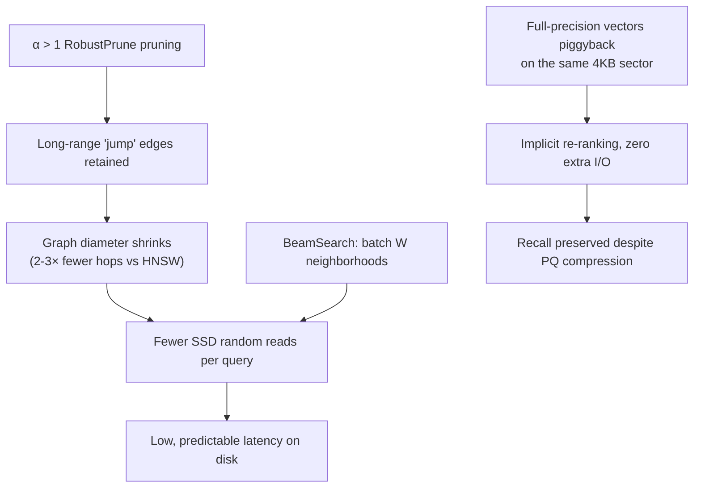

# Why DiskANN Beats HNSW on SSD — A Technical Analysis

This note explains *why* the production-scale numbers in the
[main report](../README.md) come out the way they do. It distills three papers
and connects each mechanism to a measured result from the 3.38M-vector
experiment.

**Papers**

1. **DiskANN** — *Fast Accurate Billion-point Nearest Neighbor Search on a
   Single Node*, NeurIPS 2019.
2. **FreshDiskANN** — *A Fast and Accurate Graph-Based ANN Index for Streaming
   Similarity Search*, arXiv:2105.09613 (2021).
3. **VeloANN** — *Optimizing SSD-Resident Graph Indexing for High-Throughput
   Vector Search*, VLDB 2026, arXiv:2602.22805.

---

## 1. The root cause: the α-RNG pruning rule

The deepest difference between HNSW and DiskANN's **Vamana** graph is the
edge-pruning rule used at build time.

- HNSW (and NSG) implicitly prune with **α = 1**: an edge `(p, p'')` is dropped
  as soon as *any* kept neighbor `p'` is closer to `p''` than `p` is. This keeps
  the graph sparse but leaves it with a **large diameter**.
- Vamana's `RobustPrune` uses a tunable **α > 1**: edge `(p, p'')` is dropped
  only when `α · d(p', p'') ≤ d(p, p'')`, i.e. when an intermediate node is
  *significantly* closer. This retains **long-range edges**, making the graph
  slightly denser but **much shallower**.

> DiskANN §2.4: *"Most crucially, both HNSW and NSG have no tunable parameter α
> and implicitly use α=1. This is the main factor which lets Vamana achieve a
> better trade-off between graph degree and diameter."*

Geometrically, α > 1 guarantees the distance to the query shrinks by a
*multiplicative* factor at each hop, so greedy search converges in `O(log n)`
hops instead of degrading toward `O(n)`.

### Hops are the currency of SSD latency

Every hop can be a random SSD read, so fewer hops ⇒ lower latency.

> DiskANN §4.2: *"Vamana ... makes 2-3 times fewer hops for search to converge
> on large datasets compared to HNSW and NSG."*

HNSW papers over its α = 1 diameter problem with a **multi-layer hierarchy**
(sparse long-range top layers over dense local bottom layers). Vamana gets the
same long-range connectivity directly, in a **single flat graph** — which is
exactly what you want when the graph lives on disk.

**Measured correspondence (3.38M):** raising `R` (max out-degree) from 32 to 64
moved Recall@10 from 93.3% → 97.6% while QPS fell 173 → 109. Larger `R` buys
more long-range edges (higher recall) at the cost of more neighbors processed
per hop — consistent with DiskANN Fig. 2(c), where Vamana's hop count keeps
falling with degree while HNSW's stagnates.

---

## 2. The SSD-friendly systems design

α > 1 alone is not enough; DiskANN adds three systems tricks.

| Mechanism | What it does | Paper |
|---|---|---|
| **BeamSearch** | Fetches the neighborhoods of W (e.g. 4–8) frontier nodes in one shot, amortizing SSD round-trips (a few random sectors cost ≈ one sector). | §3.3 |
| **Implicit re-ranking** | Stores full-precision vectors in the *same* 4KB sector as a node's adjacency list, so exact coordinates are read for free and used to re-rank. | §3.5 |
| **PQ in RAM, graph on SSD** | Only ~32-byte PQ codes per point stay resident; the graph and full vectors live on SSD. | §3.1 |

This is the crux of the memory win: PQ codes guide the walk cheaply, then
piggy-backed full-precision vectors fix up recall — sidestepping the recall
ceiling that pure compression methods (IVF-PQ) hit.

**Measured footprint (3.38M × 1024-dim, R=64):**

| Location | Content | Size |
|---|---|--:|
| RAM | PQ codes (32 B × 3.38M) | ~108 MB |
| RAM | hot-node graph cache | a few hundred MB |
| **RAM total** | | **< 1 GB** |
| SSD | full vectors (1024 × 4 B × 3.38M) | ~13.8 GB |
| SSD | graph structure | ~17.5 GB |
| **SSD total** | | **~31.3 GB** |

versus HNSW (Milvus) holding the whole index in **11.7 GB RAM**.

---

## 3. Where the paper's "crushing" margin comes from — and why ours is smaller

DiskANN's headline result is against **IVF-PQ**, not against a graph index:

> DiskANN Abstract: *"... where state-of-the-art billion-point ANNS algorithms
> with similar memory footprint like FAISS and IVFOADC+G+P plateau at around 50%
> 1-recall@1."*

Our 3.38M comparison is DiskANN **vs HNSW** (a graph index with no compression
loss), so the recall gap is naturally smaller (97.6% vs 92.7%). The margin also
widens with scale and dimension; at 3.38M the IVF-style boundary effects that
cripple compression methods at a billion points are not yet extreme.

---

## 4. Beyond static indexes

- **FreshDiskANN** shows that α = 1 indexes *degrade* under naive
  insert/delete, and that keeping α > 1 in the update path keeps recall stable.
  Its `StreamingMerge` lands a 7.5% change into an 800M index at **~8.5%** of a
  full rebuild — relevant if academic records are ingested incrementally.
- **VeloANN** identifies that DiskANN's synchronous I/O leaves the CPU ~57%
  idle and that page-level caching is wasteful (47.3% of vertices never
  visited, yet only 0.1% of pages untouched). Coroutine-async I/O + record-level
  caching reach **0.92× in-memory throughput at 10% of the memory** — the
  ceiling this whole line of work is pushing toward.

---

## 5. One-paragraph summary

HNSW compensates for an α = 1 graph's large diameter with a layered hierarchy;
DiskANN/Vamana instead builds long-range edges directly via α > 1, cutting
search hops 2–3×. On SSD those saved hops become saved random reads, turning
into the measured ~3.3× latency/QPS advantage. PQ-in-RAM + graph-on-SSD with
implicit full-precision re-ranking then drops memory ~12× (11.7 GB → < 1 GB)
without sacrificing recall. The price is a larger on-disk index (~4×) and a
longer build.
